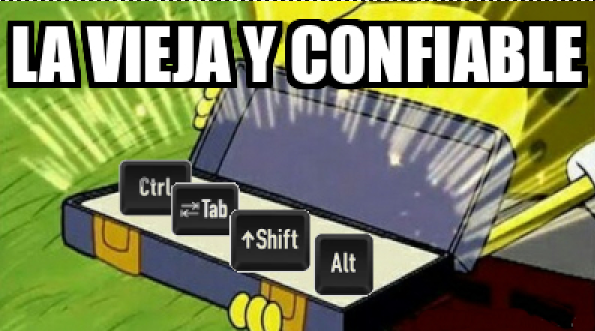

# Taller de Atajos de teclado

### Requisitos

- Tener instalado un navegador de internet:
  - Recomendamos: [Firefox](https://www.mozilla.org/es-MX/firefox/new/) o [Chrome](https://www.google.com/chrome/)

- Tener instalado [VisualStudio Code (VSCode)](https://code.visualstudio.com/download)

- Extra / Opcional 
  - Para publicar tu propio acordeón de atajos en una página de Github como esta: [Crear cuenta de Github](https://github.com/signup) y [crear una github page gratuita](https://docs.github.com/es/pages/quickstart)

## Objetivos

El objetivo *espiritual* de este curso es mostrarles las ventajas de utilizar **atajos de teclado** al utilizar la computadora, con un enfoque especial al desarrollar software o escribir código, y contagiarles el gusto (o manía) — *no desde el látigo de la obligación y la prisa, 
sino desde la alegría y el disfrute de expandir nuestro set de herramientas, nuestro libro de hechizos o nuestro mapa de atajos*.  

El objetivo *tangible* es que construyan su propio acordeón de atajos. Éste lo realizaremos en un lenguaje 
muy sensillo llamado [Markdown](https://markdown.es) y lo publicarán en una página de internet, donde podrán tenerlo a la mano y seguirlo actualizando y personalizando 
a su gusto y a sus tiempos . 

Para esto mostraré mis atajos favoritos dando un recorrido rápido por algunas herramientas digitales de uso común: 

- Un editor de texto
- El navegador de internet
- El explorador de archivos

 ### Herramientas

- [VSCode](/atajos/vscode)
- [Markdown](/atajos/vscode)

 ## Índice de atajos

 - ### [Ventanas y pestañas](/atajos/ventanas-y-pestanias)
 
 - ### [Edición de texto](/atajos/edicion-texto)
 
 - ### [VS Code](/atajos/vscode)
 
 - ### [Navegador de Internet](/atajos/navegador)
 
 - ### [Explorador de Arhivos](/atajos/explorador-achivos)
 
 - ### [Extras](/atajos/extras)
 

