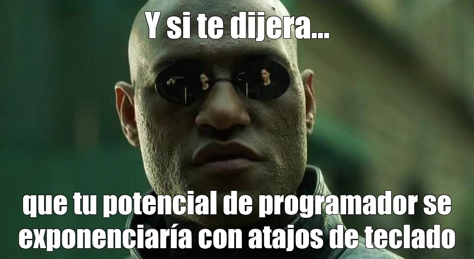

# Atajos para el Navegador

Ver también [atajos para pestañas](/atajos/ventanas-y-pestanias)

- **Tab**: Enfocar el siguiente elemento ([¿cuales?](https://developer.mozilla.org/es/docs/Web/Accessibility/Understanding_WCAG/Keyboard)) 

- **Alt + D (Cmd + L en Mac)**: Seleccionar la barra de direcciones.

- **Ctrl + F (Cmd + F en Mac)**: Abrir el cuadro de búsqueda en la página actual.

- **Ctrl  +  1-8 (Cmd +  1-8)**: Cambiar a ventana n

- **Ctrl + H (Cmd + Opción + H en Mac)**: Abrir el historial de navegación.

- **F5 (Cmd + R en Mac)**: Actualizar la página actual.

- **Alt + Flecha izquierda/derecha**: Navegar hacia atrás/adelante en el historial.

- **Ctrl + Más (+) (Cmd + Más (+) en Mac)**: Aumentar el zoom de la página.

- **Ctrl + Menos (-) (Cmd + Menos (-) en Mac)**: Disminuir el zoom de la página.

- **Ctrl + 0 (Cmd + 0 en Mac)**: Restaurar el zoom de la página al 100%.

- **Ctrl + L**: Seleccionar todo el url

- **Ctrl +  click**: Abrir enlace (link) en nueva pestaña
