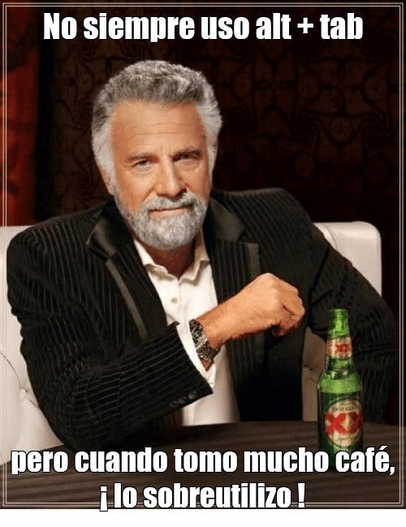

# Atajos de Ventajas y Pestañas

- **Alt + Tab (Cmd + Tab en Mac)**: Cambiar de ventana

- **Alt + Shift + Tab (Cmd + Tab en Mac)**: Cambiar de ventana en sentido contrario

- **Alt + F4 (Cmd + Q)**: Cerrar ventana

- **Alt + |**: Cambiar de ventana del mismo programa

---

- **Ctrl + T (Cmd + T en Mac)**: Abrir una nueva pestaña. (vscode ir a simbolo)

- **Ctrl + N (Cmd + N en Mac)**: Abrir una nueva ventana del navegador. (vscode nuevo archivo en pestaña)

- **Ctrl + W (Cmd + W en Mac)**: Cerrar la pestaña o ventana actual.

- **Ctrl + Shift + T (Cmd + Shift + T en Mac)**: Reabrir la última pestaña o ventana cerrada.

- **Ctrl + Tab (Ctrl + Shift + ] en Mac)**: Cambiar a la siguiente pestaña.

- **Ctrl + Shift + Tab (Ctrl + Shift + [ en Mac)**: Cambiar a la pestaña anterior.

- **Ctrl + AvPag (Ctrl + Shift + ] en Mac)**: Cambiar a la siguiente pestaña a la derecha.

- **Ctrl + RevPag (Ctrl + Shift + [ en Mac)**: Cambiar a la pestaña anterior a la izquierda.

- **Ctrl + Shift + AvPag (Fn + FlechaDer) (Ctrl + Shift + ] en Mac)**: Cambiar a la siguiente pestaña a la derecha.

- **Ctrl + Shift + RevPag (Fn + FlechaIzq) (Ctrl + Shift + [ en Mac)**: Cambiar a la pestaña anterior a la izquierda.

---

- **F11**: Activar o desactivar el modo de pantalla completa.Ver también [atajos para pestañas](/atajos/ventanas-y-pestanias)